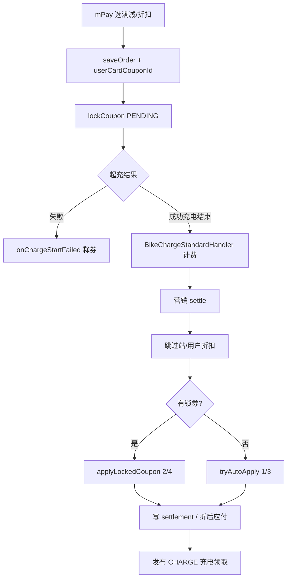

# 电单车营销用券设计

**日期：** 2026-07-18  
**分支：** `develop/charging-marketing`  
**关联：** 汽车充电营销结算（`ruleId=2`）；收尾计划 Workstream B/C 旁路扩展  

## 背景

营销用券与结算当前仅对**汽车**（`ruleId=2`）开放：

- UniApp 选券在 `bPay.vue`；电单车 `mPay.vue` 无券 UI、下单不传 `userCardCouponId`
- `AppOrderController.saveOrder` 锁券仅汽车
- `ChargeOrderBillServiceImpl.settleCarMarketingAndPublishChargeEvent` 非汽车直接 return（不结算营销、不发 CHARGE）
- 站列表「X张券可用」、站/用户折扣活动价 enrich 仅汽车站

产品要求：**电单车也要能用营销卡券**，但**电站折扣活动、用户折扣活动不适用**。

## 拍板记录

| # | 问题 | 结论 |
|---|------|------|
| 1 | C 端入口 | **仅** `mPay` 起充选券；电单车站列表 tip **本轮不做** |
| 2 | 支付方式 | 与汽车一致：余额 / 企业余额 / 微信预付可用；包月、免费不可用 |
| 3 | 满减 / 折扣 | ✅ 手动选券 → 预锁 → 结算抵扣 |
| 4 | 抵用卡 / 电量卡 | ✅ 结算**自动抵扣**（mPay 不展示选卡，同汽车） |
| 5 | 电站折扣 / 用户折扣活动 | ❌ 电单车不参与展示与结算 |
| 6 | 起充失败释券 | ✅ 电单车协议失败回执挂 `MarketingOrderCouponLockCoordinator`；超时任务兜底仍有效 |
| 7 | CHARGE 事件（充电领取活动） | ✅ **电单车结算后也发布**，可触发充电领取发券 |

## 目标

| # | 目标 |
|---|------|
| 1 | `mPay` 可选满减(2)/折扣(4)，下单预锁 |
| 2 | 电单车订单结算应用锁券抵扣，或自动抵用卡/电量卡 |
| 3 | 电单车结算**不**应用站折扣 / 用户折扣活动 |
| 4 | 电单车应付金额在存在营销结算时走折后口径 |
| 5 | 电单车起充失败即时释券 |
| 6 | 电单车结算后发布 CHARGE，支持充电领取活动 |

## 非目标

- 电单车站列表「X张券可用」、活动价标签 / `applyToPricingList` 对电单车开放
- 改变汽车侧现有营销行为（除共享代码需对 ruleId 分支处）
- Workstream C：异常单营销钩子、汽车 OCPP 释券缺口（另项；本项只补电单车起充失败释券）
- 后台新建「电单车专用」卡券类型（仍用现有卡券模板 + 站点范围匹配）

---

## 一、能力对照

| 能力 | 汽车 `ruleId=2` | 电单车 `ruleId=1`（本设计） |
|------|-----------------|---------------------------|
| 满减/折扣手动选 | `bPay` | `mPay`（对齐） |
| 抵用卡/电量卡自动抵 | settle 内 | settle 内（同逻辑） |
| 站折扣 / 用户折扣活动 | settle + 列表价 | **跳过** |
| 锁券 `saveOrder` | ✅ | ✅ |
| 营销 settle | ✅ | ✅（无活动折） |
| CHARGE 充电领取 | ✅ | ✅ |
| 列表「X张券可用」 | ✅ | ❌ 本轮不做 |
| 起充失败释券 | 汽车 TCP 已挂 | 电单车协议失败路径补挂 |

---

## 二、前端（`mPay.vue`）

对齐 `bPay.vue` 选券体验（可抽公共逻辑，非必须）：

1. **展示条件**：非包月、非免费；与 `showCouponSection` 同类判断  
2. **券列表**：`GET /marketing/coupon/available`，前端过滤 `cardCouponType` ∈ `{2,4}`  
3. **预览**：`/marketing/coupon/preview`；电费/服务费拆分用订单/计费可得字段，**禁止**照搬汽车 7:3 硬编码（按电单车 `priceType` / 已算电费服务费传 preview）  
4. **下单**：`POST /order/saveOrder` 增加可选 `userCardCouponId`  
5. **文案**：预计节省「以结算为准」；自动卡不出现在选择器  

---

## 三、后端

### 3.1 锁券

`AppOrderController.saveOrder`：

- 条件由「仅汽车」改为「汽车 **或** 电单车」+ `userCardCouponId` 非空 + 非 FREE/MONTH_CARD  
- 仍调用现有 `marketingChargeSettlementService.lockCoupon()`（内部已限制手动券类型 2/4）

### 3.2 结算编排

入口：`ChargeOrderBillServiceImpl.settleCarMarketingAndPublishChargeEvent`（建议改名或保留方法名但注释改为「汽车/电单车」）：

- **去掉**「非 ruleId=2 则 return」；对 `ruleId` ∈ `{1,2}` 执行营销  
- 调用 settle 后**始终**尝试发布 CHARGE（汽车、电单车均发）  
- `resolveOrderPayableAmount`：存在营销结算汇总时，电单车与汽车一样用折后应付  

`MarketingChargeSettlementServiceImpl.settle`（或等价门面）：

```
1. if ruleId == 2:
       applyActivityDiscountToOrder()   // 站折扣 + 用户折扣
   else if ruleId == 1:
       // skip 活动折
2. if 有 PENDING 锁券:
       applyLockedCoupon()              // 满减/折扣
   else:
       tryAutoApply()                   // 抵用卡/电量卡
3. 写 settlement / discount_info（复用现有）
```

双轨资金 / 补款：有平台侧券折时，与汽车同一套 `OrderSettlementInfo` / 台账字段语义（不另开表）。

### 3.3 起充失败释券

在电单车设备回执「起充失败 / 启动失败」处调用：

`MarketingOrderCouponLockCoordinator.onChargeStartFailed(orderCode, reason)`

覆盖现网电单车接入（如星充 MQTT、微伽 bike 等——实现时按仓库内实际失败分支逐个挂，与汽车 YKC/WM/WJ 同模式）。  
现有起充超时退款任务若已调协调器，保持作为兜底。

### 3.4 充电领取（CHARGE）

- 事件：`MarketingTriggerEvent.charge(userId, tenantId, power, stationId, orderCode)`  
- 电单车结算成功路径与汽车一样发布  
- 活动侧若配置了站点范围，仍走现有 `matchStationScope`；未配电站范围的活动对电单车站同样可发（与现逻辑一致，不新增电单车开关）

---

## 四、数据流（电单车）



---

## 五、验收

| # | 场景 | 期望 |
|---|------|------|
| B1 | mPay 选满减，余额支付充完 | 应付含券折；有 use_record / discount_info |
| B2 | mPay 不选券，有可用抵用卡 | 结算自动抵；mPay 无选卡 UI |
| B3 | 有电量卡无手动券 | 自动电量卡抵扣（规则同汽车） |
| B4 | 站点配置了站折扣活动 | 电单车订单**无**活动折明细；汽车仍有 |
| B5 | 用户折扣活动进行中 | 电单车不享受；汽车仍可 |
| B6 | 包月支付 | 无选券 / 不锁券 |
| B7 | 起充失败 | 预锁券回未使用 |
| B8 | 充电领取活动 + 电量达标 | 电单车结算后可发券 |
| B9 | 汽车回归 | bPay / 活动折 / 自动卡行为不变 |

---

## 六、仓库改动面

| 仓库 | 改动 |
|------|------|
| `charging-cloud-uniapp` | `mPay.vue`（+ 可选抽公共选券） |
| `charging-cloud` | `AppOrderController` 锁券闸门；`ChargeOrderBillServiceImpl` 入口/应付；`MarketingChargeSettlementServiceImpl` 跳过活动折；电单车 transport 释券钩子 |
| `charging-cloud-web` | 本文档；可选更新 remaining-gaps「单车排除」表述 |

## 七、实现顺序建议

1. 后端：锁券闸门 + settle 分支（skip 活动折）+ 应付 + CHARGE 对电单车开放  
2. 后端：电单车起充失败释券钩子  
3. UniApp：`mPay` 选券  
4. 验收 B1–B9  

## 八、风险

- 电单车电费/服务费拆分与 `priceType` 相关，preview/结算基数需用计费结果，避免错算  
- 电单车协议多厂家，释券钩子需逐协议补齐，避免只接一家  
- 充电领取活动若未限制站点业态，电单车开始 CHARGE 后发券量可能上升——属预期产品行为  

---

## 实现状态

| 仓库 | Commit | 说明 |
|------|--------|------|
| `charging-cloud` | `82ef2802` | 锁券闸门 + settle 跳过活动折 + 折后应付 + CHARGE |
| `charging-cloud` | `1bbca378` | WJ 电单车起充失败释券（MQTT/TCP） |
| `charging-cloud` | `bc1ec3d2` | preview 跳过电单车活动折 |
| `charging-cloud-uniapp` | `68c8b10` | mPay 满减/折扣手选券 |
| `charging-cloud-web` | `5cc1810` | 计划勾选 + 实现状态 |

**手工验收 B1–B9：** 待执行（未勾选）。

**Plan：** `docs/superpowers/plans/2026-07-18-bike-marketing-coupon.md`
